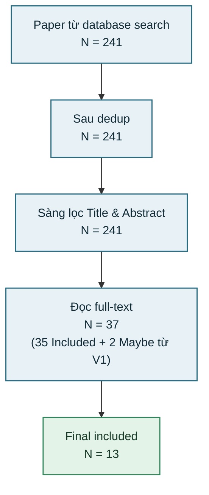

# PRISMA Flow

## Giai đoạn 1: Nhận diện (Identification)

> `Sau dedup (N = 241)` khớp số dòng trong `01_all_records.csv`.

## Chi tiết sàng lọc

### Loại V1: 204 bài

| Mã          | Số lượng | Lý do                                        |
| ----------- | -------: | -------------------------------------------- |
| EC-O        |       96 | Ngoài phạm vi / không phải ngưng thở ban đêm |
| NO ABSTRACT |       69 | Thiếu bản tóm tắt, không đủ dữ liệu          |
| EC-N        |       17 | Bài tổng quan / review / editorial           |
| EC-W        |       11 | Thiết bị đeo / cảm biến dán tiếp xúc da      |
| EC-1        |       10 | Đối tượng trẻ em / sơ sinh                   |
| EC-S        |        1 | Báo cáo ca bệnh đơn lẻ / case study          |
| **Tổng**    |  **204** |                                              |

### Loại V2: 24 bài

| Mã        | Số lượng | Lý do                                        |
| --------- | -------: | -------------------------------------------- |
| No access |       12 | Không truy cập được bài toàn văn             |
| EC-W      |        6 | Dán máy lên người / cảm biến tiếp xúc cơ thể |
| EC-S      |        3 | Tóm tắt kỷ yếu hội nghị ngắn, thiếu thông số |
| EC-O      |        2 | Mục tiêu không khớp bài toán OSA tự nhiên    |
| EC-1      |        1 | Thực nghiệm trên trẻ nhỏ                     |
| **Tổng**  |   **24** |                                              |

> `Final included (N = 13)` khớp số dòng `Include` trong `03_final_included.csv`.
